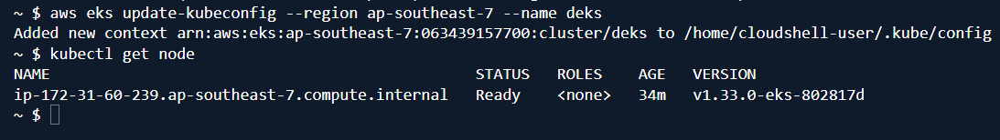
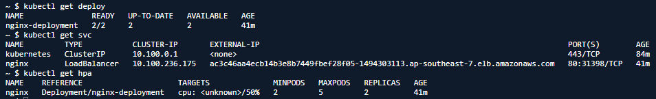
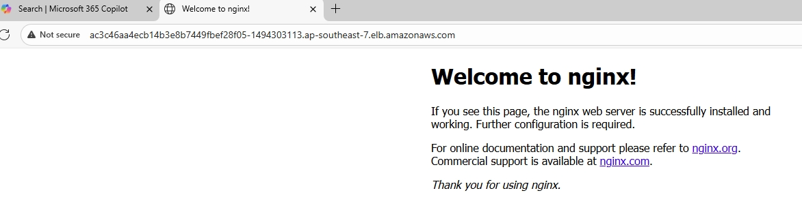
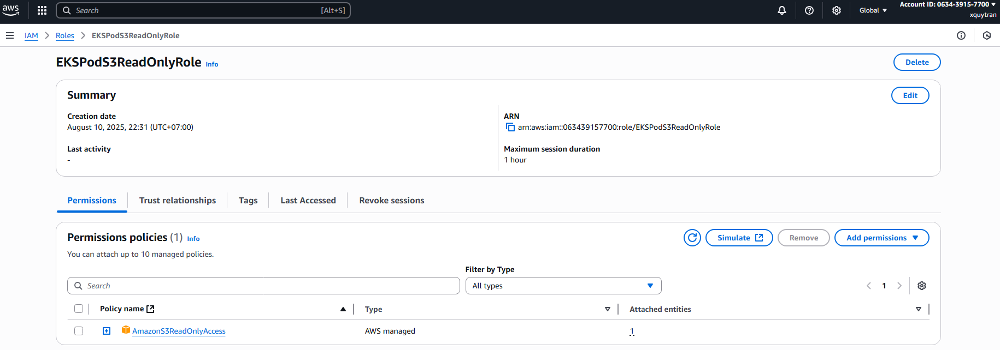
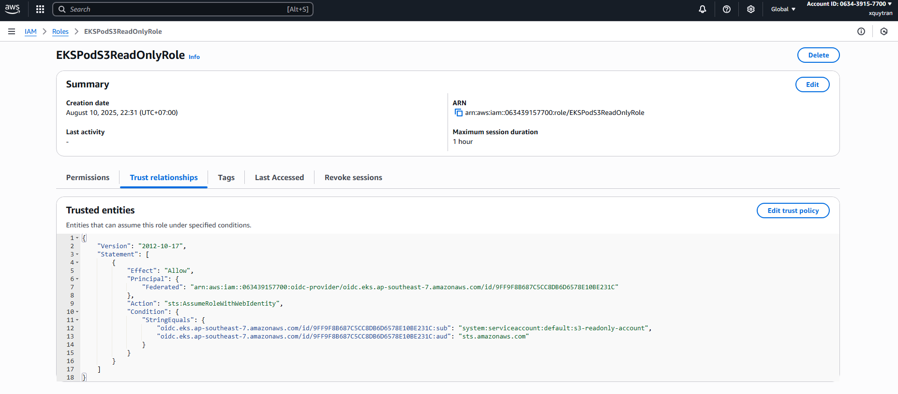
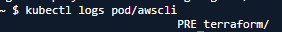
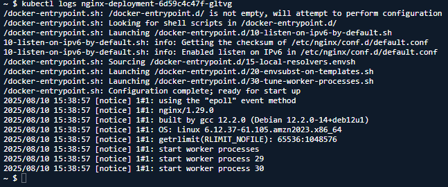

# Provision the cluster with Terraform
- Optional: create a object storage for Terraform backend, e.g S3 bucket
- Run command in terraform folder:
```sh
# for local backend
terraform init

# for remote backend
terraform init -backend-config="bucket=" -backend-config="key=" -backend-config="region="

# Review and apply
terraform plan -out=tfplan -var user_name=<cluster_user_name>
terraform apply -auto-approve tfplan
```
- Deploy application by applying Kubernetes manifests in k8s-manifests folder
```sh
kubectl apply -f k8s-manifests/
```
- [Create an IAM role for EKS pod](https://docs.aws.amazon.com/eks/latest/userguide/associate-service-account-role.html)
    - Create a trust policy to allow the cluster's OIDC provider and service account to assume an IAM role
    - Create a role with the trust relationship, fill in the account id and oidc provider
    ```sh
    aws iam create-role --role-name "EKSPodS3ReadOnlyRole" --assume-role-policy-document file://iam/trust-relationship.json --description "Allow EKS service account to read S3 bucket"
    ```
    - Attach an IAM policy to the role
    ```sh
    aws iam attach-role-policy --role-name "EKSPodS3ReadOnlyRole" --policy-arn=arn:aws:iam::aws:policy/AmazonS3ReadOnlyAccess
    ```
- Annotate your service account with the Amazon Resource Name (ARN) of the IAM role to assume
```sh
kubectl annotate serviceaccount -n default $service_account eks.amazonaws.com/role-arn=arn:aws:iam::$account_id:role/my-role
kubectl describe serviceaccount $service_account -n default
```
# Deployment
## Provision cluster
EKS cluster running



## Deploy application
Application deployment with service and autoscaling configured



Access application through browser



## IAM role for service account
IAM role 

Deploy a AWS CLI pod using the service account to list object of a S3 bucket
```sh
kubectl apply -f k8s-manifests/pod.yaml
```
AWS CLI run result


## Collect logs and metrics
Get log of application



# References
[IAM roles for service accounts](https://docs.aws.amazon.com/eks/latest/userguide/iam-roles-for-service-accounts.html)