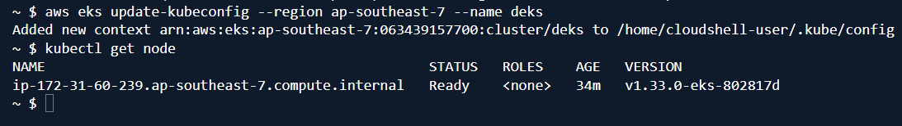
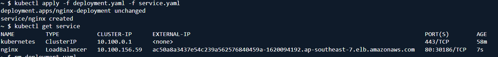
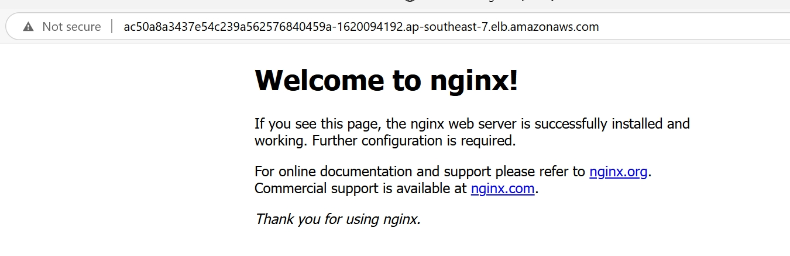

# Provision the cluster with Terraform
- Optional: create a object storage for Terraform backend, e.g S3 bucket
- Run command in terraform folder:
```sh
# for local backend
terraform init

# for remote backend
terraform init -backend-config="bucket=" -backend-config="key=" -backend-config="region="

# Review and apply
terraform plan -out=tfplan
terraform apply -auto-approve tfplan
```

- 
# Deployment result

EKS cluster running



Application and service deployment


Access application through browser
